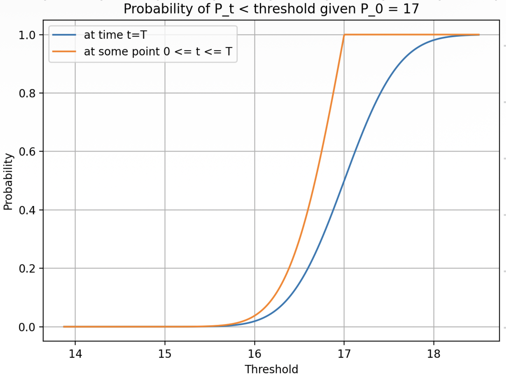
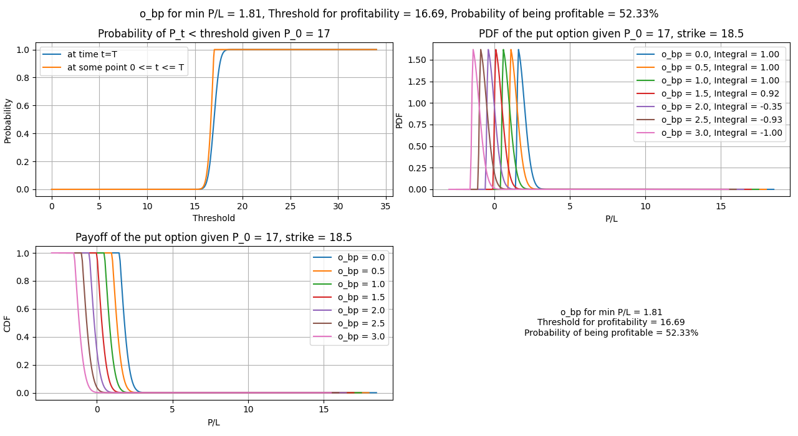
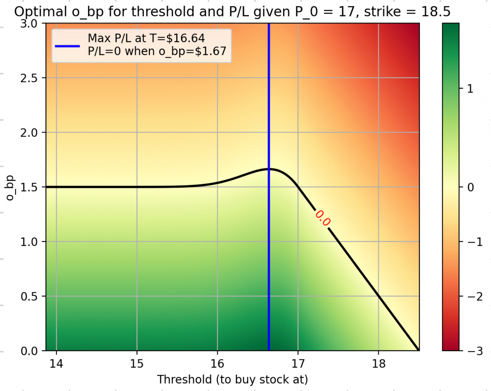

[](https://creativecommons.org/licenses/by/4.0/)

# Option Bid Price Modelling

This was an old project of mine. The idea: Model the option prices as a Wiener process and offer better prices than the straight arbitrage by using the reflection theorem (and making use of the underlying's volatility). With this, I modelled the likelihood of stock prices reaching exercise thresholds during an option's lifetime. See below!

## Overview

The core idea is to exploit potential mispricings in deep ITM options by:

1. Monitoring real-time stock and option data streams
2. Identifying put options where the bid price is below intrinsic value: $o_{bp} < o_{strike} - s_{ap}$ (or for calls: $o_{bp} < s_{bp} - o_{strike}$)
3. Buying such an option and simultaneously trading the underlying stock to lock in a profit

This repository develops the mathematical framework to determine the **maximum option bid price** ($o_{bp}$) at which this strategy remains profitable in expectation.

## Identifying Arbitrage Candidates

We listen to the stock and option data streams and filter for option quotes priced below their intrinsic value. When the option bid price ($o_{bp}$) is sufficiently low, we buy the option and exercise it against the underlying stock, profiting from the difference between the strike price and the stock price minus the premium paid.

<p align="center">
  
</p>
<p align="center"><em>Figure 1: Option premiums (bid and ask for puts and calls) vs strike price. Pink stars indicate placed bids. Dashed lines show the intrinsic value boundaries y = x - S<sub>0</sub> and y = -x + S<sub>0</sub> where S<sub>0</sub> = 17.02.</em></p>


## Probabilistic Framework

Rather than waiting for exact arbitrage (which will never happen nowadays), we develop a probabilistic model to determine a fair bid price for the option — the maximum we can pay while still expecting a profit in the long run if we assume it to behave purely like a Wiener process (random motion) with historical volatility (big assumption).

### Stock Price Model

We model the stock price as a random walk (Brownian motion) with variance that scales linearly with time. The historical volatility of the underlying stock over the last $N$ days is:

$$\sigma = \sqrt{\sum r_i^2}$$

The standard Black-Scholes parameters are:

$$d_1 = \frac{\ln(S/K) + (r + \tfrac{\sigma^2}{2})T}{\sigma\sqrt{T}}, \qquad d_2 = d_1 - \sigma\sqrt{T}$$

### Reflection Principle for American Options

For European options, we only need the probability of the stock being below a threshold at maturity $T$. But for **American options**, we need the probability of the stock reaching a threshold at **any point** during $[0, T]$.

This is calculated using the **reflection principle of a Wiener process**. The key insight is: after the stock reaches any threshold, its expected move is zero (symmetric random walk), so it is equally likely to end above or below that threshold at maturity. Therefore, the probability of ever reaching a threshold is exactly twice the probability of being beyond it at expiry:

$$P_\text{cum}\!\left(S_t \leq x \text{ for some } t \in [0, T]\right) = \min\!\left(2 \cdot \Phi\!\left(\frac{x - S_0}{\sigma\sqrt{T}}\right),\; 1\right)$$

where $\Phi$ is the standard normal CDF. This is valid for thresholds $x < S_0$ (downward moves), since for $x \geq S_0$ the probability is trivially 1.

<p align="center">
  
</p>
<p align="center"><em>Figure 2: Probability of the stock price falling below a threshold. Blue: at maturity t = T only. Orange: at any point during [0, T] (reflection principle). Example with S<sub>0</sub> = 17, 2 days to expiration.</em></p>

## PnL Analysis

### Constructing the PnL Distribution

Given a put option with strike $K$ and the option bid price $o_{bp}$ we pay, the payoff when the stock reaches price $P$ is:

$$\text{PnL}(P) = \max(K - P,\; 0) - o_{bp}$$

By mapping the threshold probabilities to the corresponding PnL values, we construct:

1. **CDF of PnL**: the cumulative distribution of payoffs for different option bid prices
2. **PDF of PnL**: the derivative of the CDF, giving the probability density of each payoff level

The integral of the PDF indicates whether a given $o_{bp}$ is fairly priced:
- Integral $= 1.0$: the option is underpriced (expected profit)
- Integral $< 0$: the option is overpriced (expected loss)

A risk-neutral option price is achieved when the expected PnL equals zero. Importantly, this does not mean 50% of trades are profitable — it means the expected dollar return is zero.

<p align="center">
  
</p>
<p align="center"><em>Figure 3: PnL analysis for different option bid prices (o<sub>bp</sub>). <b>Top-left:</b> Probability of reaching threshold (CDF). <b>Top-right:</b> PDF of PnL — integral = 1.00 for fairly-priced options, negative for overpriced. <b>Bottom-left:</b> CDF of PnL (payoff curves). <b>Bottom-right:</b> The risk-neutral bid price is o<sub>bp</sub> = $1.81, with a profitability threshold of $16.69 and 52.33% probability of profit.</em></p>

### Expected PnL Formula

The expected PnL for a given option bid price $o_{bp}$ and stock buying threshold $T$ combines two scenarios:

$$\text{PnL}_T = (1 - P_{\text{cum},T}) \cdot \max(K - S_0 - o_{bp},\; -o_{bp}) \;+\; P_{\text{cum},T} \cdot (K - T - o_{bp})$$

where:
- $P_{\text{cum},T}$ = probability of the stock reaching threshold $T$ at any point during the option's lifetime
- First term: payoff if the stock never reaches the threshold (exercise at $S_0$ or let the option expire)
- Second term: payoff if the stock does reach threshold $T$ (buy stock at $T$, exercise put at strike $K$)

## Optimal Bid Price

By evaluating the expected PnL across all combinations of stock buying thresholds and option bid prices, we construct a heatmap:

<p align="center">
  
</p>
<p align="center"><em>Figure 4: Expected PnL as a function of stock buying threshold (x-axis) and option bid price o<sub>bp</sub> (y-axis). Green = positive expected PnL, red = negative. The <b>black contour</b> marks PnL = 0. The <b>blue line</b> traces the optimal threshold (maximum PnL) for each o<sub>bp</sub>.</em></p>

**Key results** for the example ($S_0 = 17$, strike $K = 18.5$, 2 days to expiry):

| Metric | Value |
|--------|-------|
| Maximum PnL threshold | T = $16.64 |
| Limiting bid price | o_bp = $1.67 |
| Probability of being profitable | 52.33% |

The limiting bid price of $\$1.67$ is the highest option price that still yields non-negative expected PnL. Any option purchased below this price is expected to be profitable in the long run. Note, how this is more competitive than the $\$1.50$ straight arbitrage price! A fun way to develop this mathematically.

## Usage

### Dependencies

```
pip install numpy scipy matplotlib
```

### Running

Both scripts accept CLI parameters and default to the example values used throughout this writeup ($S_0 = 17$, strike $= 18.5$, 2 days, 2% daily volatility).

```bash
# Compute PnL distribution across different option bid prices
python option_bid_price_model_retrospective_bids.py

# Find optimal stock buying threshold for each bid price (heatmap)
python option_bid_price_model_with_optimal_thresholds.py
```

#### CLI Parameters

| Parameter | Description | Default |
|-----------|-------------|---------|
| `--stock-price` | Current stock price $S_0$ | 17 |
| `--strike` | Put option strike price | 18.5 |
| `--days` | Days to expiration | 2 |
| `--volatility` | Daily volatility as fraction of stock price | 0.02 |
| `--save PATH` | Save figure to file instead of displaying | *(show)* |

#### Example

```bash
# Custom scenario: $50 stock, $55 strike, 5 days, 3% daily volatility
python option_bid_price_model_with_optimal_thresholds.py \
  --stock-price 50 --strike 55 --days 5 --volatility 0.03

# Save output to file
python option_bid_price_model_retrospective_bids.py --save figures/output.png
```

